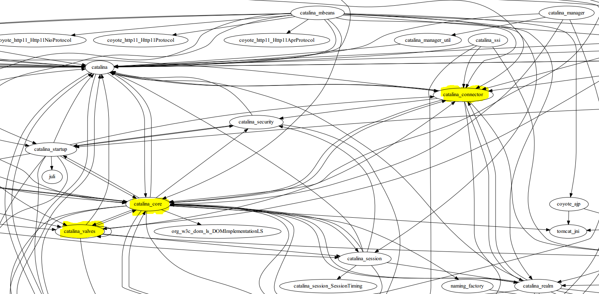
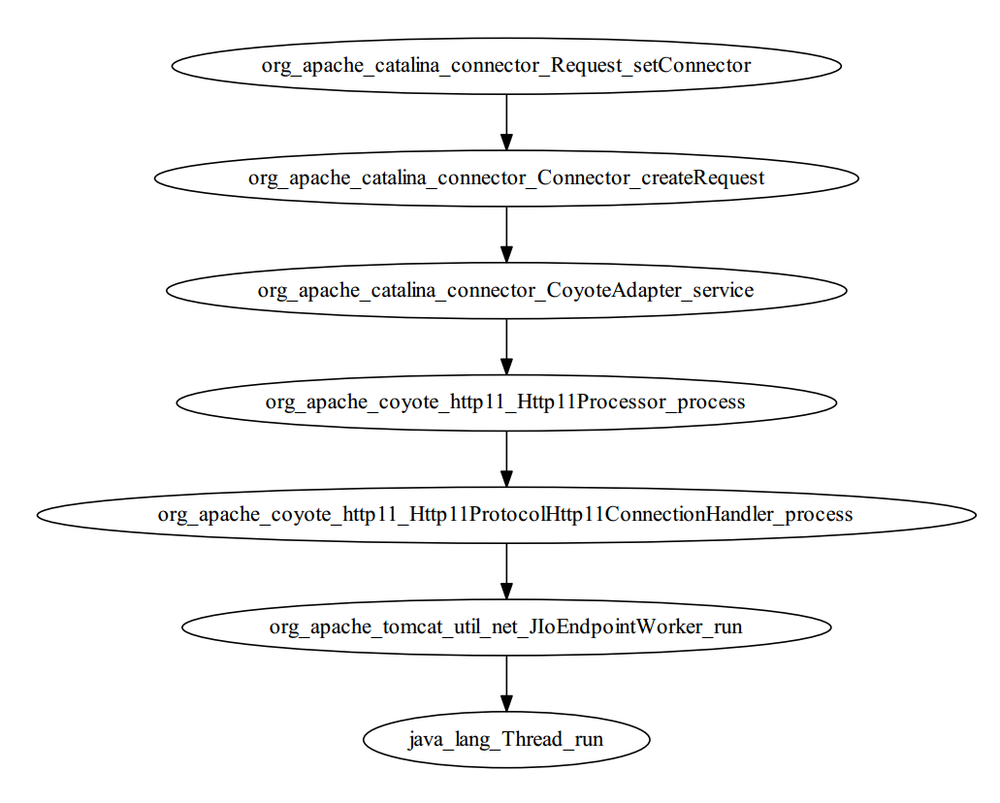
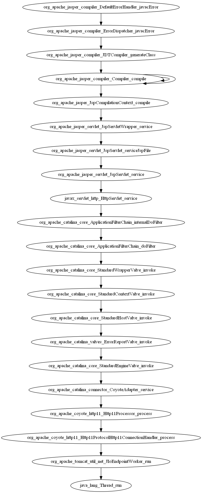

# Analyse Tomcat 

## Aufgabenstellung
Die Aufgage ist die grobe Architektur von Tomcat zu analysieren und zu dokumentieren. 
Durch die Dokumentation soll ein Überblick über den Quellcode von Tomcat erstellt werden.
Von besonderem Interesse ist das Zusammenspiel der Paketstruktur und der Klassen, um die Aufgaben und die Bereiche des Servers aufzuzeigen.

## Vorgehensweise
Über die import Statements ist es möglich die Zusammengehörigkeit der Klassen zu analysieren. Mit Hilfe der Script-Befehle -grep und -sed wurden die Quelltexte gefiltert. 
Klassen wie z. B. jUnit-Tests, die nicht den Ablauf des Programms beeinflussen, können hierbei direkt ausgefiltert werden.

grep = Mit grep lassen sich Dateien nach bestimmten Textstücken durchsuchen. Die Suchmuster werden "regular expressions" (auf Deutsch: regulärer Ausdruck) genannt.

sed = sed (von stream editor) ist ein nicht-interaktiver Texteditor für die Verwendung auf der Kommandozeile oder in Skripten

Erstellen der .dot Datei
```
echo "digraph {" > test.dot ; grep -R "^import" * | sed -E "s/\//./g" | \
sed -E "s/\.java//g" | sed -E "s/\.\*//g" | sed -E "s/import //g" | \
grep -v ":java" | grep -v ":javax" | sed -E "s/;//g" | sed -E "s/:/ -> /" | \
grep -v "\.properties" | sed -E "s/\./_/g" | sed -E "s/_[A-Z].* ->/ ->/g" | \
sed -E "s/-> ([a-z_]*)_[A-Z][a-zA-Z]*/-> \1/g" | sed -E "s/org_apache_//g" | \
grep -v "juli_logging" | grep -v "tomcat_util" | grep -v "cataline_util" | grep -v "test" | \
sort | uniq >> test.dot ; echo "}" >> test.dot ;
```

Es wird eine .dot Datei erstellt, die für Klassen die verwendeten Pakete auflistet. Aus dieser Datei kann, durch das Programm Graphviz, eine PDF-Datei, catalina.dot, erstellt werden, welche die Verknüpfung der Klassen als Diagramm darstellt. 

Erstellen der .pdf Datei für den Graphen
```
dot -Tpdf catalina.dot > catalina.pdf
```
[Graph als PDF](outputs/catalina.pdf)

Hierbei wurden die Pakete catalina_core, catalina_valves und catalina_connector deutlich in den Mittelpunkt gestellt und sehr häufig verbunden.
In den Paketen catalina_core und catalina_connector konnten wir die Klassen ApplicationRequest.java (catalina_core) und Request.java (catalina_connector) finden, die auf das Handling des Requests hinweisen.



Als erstes haben wir für die Klasse ApplicationRequest.java einen Breakpoint gesetzt und den Server mit dem Debugging-Tool gestartet. Die Klasse ApplicationRequest.java wird bei einem Get-Request nicht angesprochen, weshalb wir dann einen Breakpoint für die Klasse Request.java (catalina_connector) gesetzt haben.
Hierbei ist uns aufgefallen, dass zwischen dem Erstellen der Objekte Request und Response, in der Klasse Connector.java, der Methodenaufruf request.setConnector(this) ausgeführt wird. Deshalb haben wir in der Klasse in der Implementierung der setConnector-Methode eine Exception werfen lassen, um den [Stacktrace](outputs/stacktrace_setConnector.txt) auszugeben. Jedoch war dieser Stacktrace nicht sehr aussagekräftig für die Architektur.



Um einen detailierteren Stacktrace zu erhalten, haben wir einen try-catch-Block, zum werfen einer [Exception](outputs/exception.txt) in die Servletklasse index.jsp (wird als Startseite aufgerufen) eingefügt. So wurde uns ein ausführlicherer [Stacktrace](outputs/StackTrace.md) ausgegeben.




## Probleme
* Arbeiten mit einem Windows-Betriebssystem. Besser gleich Linux benutzen.
* Obwohl man mit GraphViz eine sehr gute Übersicht über die Zusammenhänge erhält, muss der Einstieg ein wenig erraten werden.
* Aussagekräftiger StackTrace erst erhalten durch Einfügen eines Try-Catch-Blocks in der Servletklasse index.jsp.
* Aufruf der Index.jsp nur über direkten Aufruf von http://localhost:8080/index.jsp möglich, sonst wird nur index.html aufgerufen, selbst wenn diese gelöscht ist.
